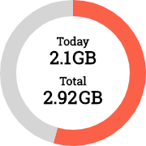

# egg-widget



[KT 에그](http://www.infomark.co.kr)의 데이터 사용량을 표시해주는 [일렉트론](https://electronjs.org/) 기반의 데스크탑 위젯

## 설정

> `config.json`

| 키 | 설명 |
| -- | --- |
| `size` | 위젯 크기 (픽셀) |
| `plan` | 현재 요금제의 데이터 제공량 |
| `color` | 그래프 색상 |
| `precision` | 표시될 소수점 자릿수 |
| `interval` | 새로고침 주기 (밀리초) |
| `username` | 에그 관리자 계정명 |
| `password` | 에그 관리자 계정 비밀번호 |

### 예시

```json
{
  "size": 180,
  "plan": "11gb",
  "color": "#fb6149",
  "precision": 2,
  "interval": 2500,
  "username": "user",
  "password": "info01234"
}
```

## 사용법

```bash
yarn install && yarn start
```

## 지원되는 기기

### 동작 확인됨

- [IML500](http://www.infomark.co.kr/shop/item.php?it_id=1499042001)

### 미확인

- ?

## 라이선스

[MIT License](LICENSE)

## 도와주신 분들
* [@Doro-nyong](https://github.com/Doro-nyong) - [위젯 디자인](https://twitter.com/dnpfcltmdnjsdid/status/1083828614355767296)